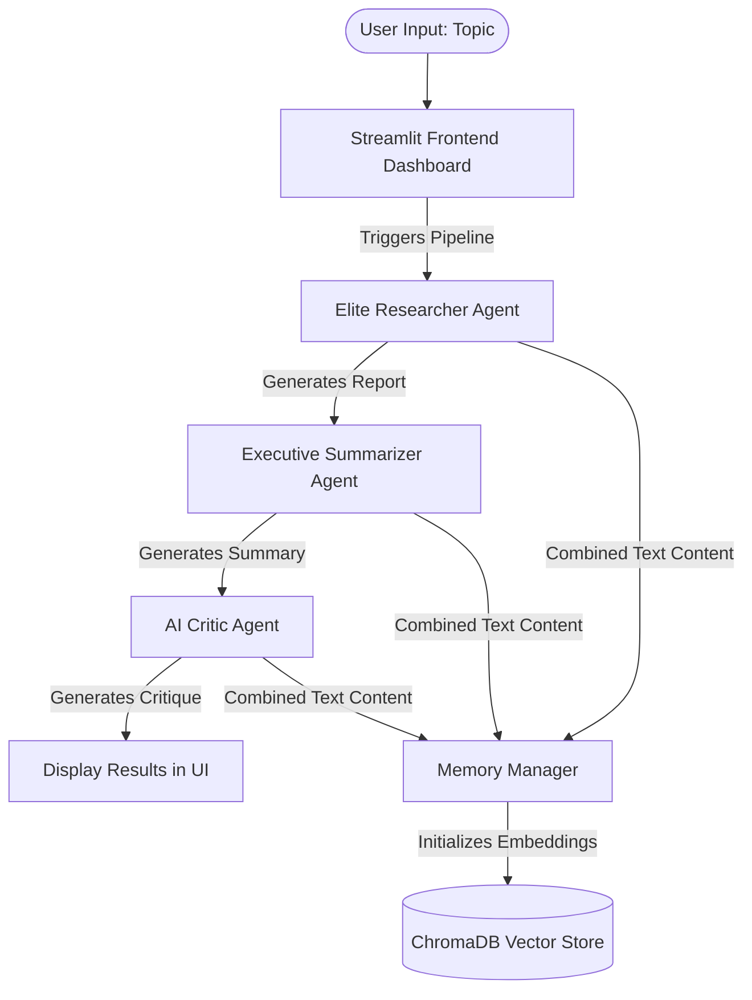

# Autonomous Multi-Agent Research Assistant (Nexus AI OS)

This repository implements a highly collaborative, autonomous multi-agent AI system designed to automate deep technical research, summarize papers, critique findings, and index them into a long-term vector memory store.

---

## 1. Project Overview & Goals
When a user inputs a research topic, a network of specialized agents executes a structured pipeline to fetch real-world data, summarize details, critique findings, and archive findings to long-term memory for semantic recall in future tasks.

### Core Agent Network
*   **Elite Researcher**: Retrieves information and compiles a structured technical report.
*   **Executive Summarizer**: Condenses long papers and reports into high-density summaries.
*   **AI Critic**: Analyzes drafts, reviews summaries, and critiques findings for errors or gaps.
*   **Planner Agent** *(In Progress)*: Lays out experimental paths and guides the research route.
*   **Report Writer** *(In Progress)*: Synthesizes critiques into final publication-grade reports.

---

## 2. Technical Stack
*   **Language & Runtime**: Python 3.11
*   **UI Dashboard**: Streamlit 1.57.0 with a custom premium dark UI theme
*   **LLM Engine**: Groq Llama-3.3-70B API
*   **Vector Memory Store**: ChromaDB 1.1.1
*   **Embedding Pipeline**: Hugging Face `sentence-transformers` (`all-MiniLM-L6-v2` embedding model)
*   **Automation Tools**: Playwright browser automation, web search scrapers, and PDF readers

---

## 3. Architecture & Agent Workflow

The diagrams below outline how the agents interact and how data flows from user input to vector database storage.



---

## 4. Current Implementation Status

### Completed Components
*   **Glassmorphic UI (`frontend/app.py`)**: A modern SaaS-like interface featuring interactive step-by-step progress tracking, responsive inputs, and hardware-accelerated transitions.
*   **Agent Modules (`agents/`)**:
    *   [researcher_agent.py](file:///c:/Users/man%20dhanani/OneDrive/Desktop/Autonomous-Research-Assistant/agents/researcher_agent.py): Orchestrates research compilation using prompt engineering and the Groq API.
    *   [summarizer_agent.py](file:///c:/Users/man%20dhanani/OneDrive/Desktop/Autonomous-Research-Assistant/agents/summarizer_agent.py): Condenses technical report drafts.
    *   [critic_agent.py](file:///c:/Users/man%20dhanani/OneDrive/Desktop/Autonomous-Research-Assistant/agents/critic_agent.py): Reviews findings for clarity, depth, and accuracy.
*   **Vector Memory System (`memory/`)**:
    *   [chroma_store.py](file:///c:/Users/man%20dhanani/OneDrive/Desktop/Autonomous-Research-Assistant/memory/chroma_store.py): Houses client settings and manages vector collections.
    *   [memory_manager.py](file:///c:/Users/man%20dhanani/OneDrive/Desktop/Autonomous-Research-Assistant/memory/memory_manager.py): Integrates document processing, generates metadata, and initiates database writes.

### Work In Progress
*   [planner_agent.py](file:///c:/Users/man%20dhanani/OneDrive/Desktop/Autonomous-Research-Assistant/agents/planner_agent.py): Framework setup for experimental planning.
*   [report_agent.py](file:///c:/Users/man%20dhanani/OneDrive/Desktop/Autonomous-Research-Assistant/agents/report_agent.py): Final report compiler framework.
*   **Browser & Web Tools**: Scraping tools inside `tools/` are ready to be wired into the Researcher agent.

---

## 5. This Week's Accomplishments

### Key Bug Fixes & Optimizations
*   **Resolved Memory System Error**: Debugged an issue where `sentence-transformers` was failing to import because of a `KeyError: 'tokenizers'` raised within Streamlit's file watcher.
*   **Pre-Import Concurrency Fix**:
    *   Streamlit's `local_sources_watcher` was colliding with Hugging Face's lazy loader in a background thread when importing `sentence_transformers` and `transformers` concurrently.
    *   **Fix**: Added a synchronous pre-import for `sentence_transformers` at the top of [memory/chroma_store.py](file:///c:/Users/man%20dhanani/OneDrive/Desktop/Autonomous-Research-Assistant/memory/chroma_store.py) to resolve the race condition.
*   **Environment Validation**: Configured the virtual environment (`venv`) successfully, verifying that all imports execute cleanly and stably.

---

## 6. Next Week's Roadmap

*   **[ ] Live Web Search Integration**: Integrate `tools/web_search_tool.py` and `tools/browser_tool.py` directly into the Researcher Agent to retrieve real-time search queries and articles.
*   **[ ] Self-Correction Loops**: Build feedback loops where the Researcher agent parses the Critic's critique and automatically refines the final report.
*   **[ ] Memory Recall & Context Ingestion**: Implement the query retrieval path in `memory_manager.py` so the Researcher agent queries ChromaDB for relevant historical research and prepends it to the prompt.
*   **[ ] Planner and Report Agents Integration**: Fully implement `planner_agent.py` and `report_agent.py` in the pipeline UI to enable multi-turn research iterations.

---

## 7. How to Setup & Run

### Prerequisites
Ensure Python 3.11 is installed.

### Setup
Activate the virtual environment and verify requirements:
```powershell
# Activate venv on Windows
.\venv\Scripts\Activate.ps1

# Install requirements if needed
pip install -r requirements.txt
```

### Running the App
Run the Streamlit frontend. It is recommended to use the `--server.fileWatcherType none` flag to optimize performance and prevent file-locking locks on Windows:
```powershell
.\venv\Scripts\streamlit run frontend/app.py --server.fileWatcherType none
```

---

## 8. References
*   [Streamlit Documentation](https://docs.streamlit.io)
*   [ChromaDB Documentation](https://docs.trychroma.com)
*   [Hugging Face Sentence Transformers](https://sbert.net)
*   [Groq API Reference](https://console.groq.com/docs)
