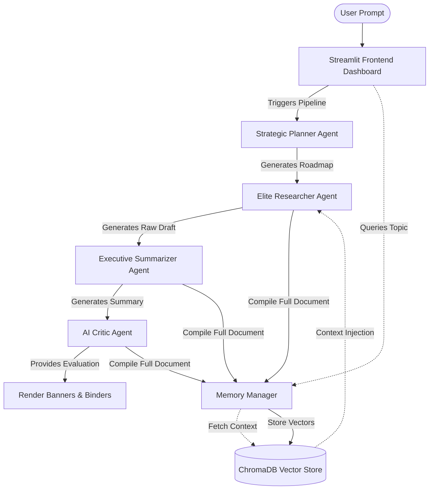

# 🌌 Nexus AI OS: Autonomous Multi-Agent Research Assistant

[](https://www.python.org/)
[](https://streamlit.io/)
[](https://www.trychroma.com/)
[](https://groq.com/)

Nexus AI OS is a premium, state-of-the-art multi-agent research platform designed to automate deep technical research, synthesize publication-grade reports, critique analytical findings, and index intelligence records into a long-term vector memory store. Built on top of a highly modular Python runtime and hosted on a glassmorphic Streamlit SaaS dashboard, Nexus coordinates an array of specialized AI agents working collectively to turn simple search prompts into comprehensive technical briefs.

---

## ⚡ Why Use Nexus?

Conducting high-fidelity technical research is usually a manual, multi-step process involving documentation gathering, outlines, drafting, and critical reviews. Nexus eliminates this overhead by orchestrating a dedicated neural pipeline:

*   **Deep Semantic Memory (RAG)**: Automatically searches and retrieves related historical research from past sessions, injecting context to prevent repeating queries.
*   **Structured Output Design**: Delivers multi-section documents with clean visual layouts (Executive Summary, AI Critic Evaluation, and Full Reports).
*   **Dynamic Telemetry Tracking**: Monitors vector databases, LLM latency, and agent responses in real time.
*   **Fully Configurable Control**: Fine-tune LLM parameters, similarity thresholds, and vector namespaces from a centralized control panel.

---

## 🤖 The Neural Agent Network

Nexus distributes research work across highly specialized AI agents that execute asynchronously:

```
┌────────────────────────────────────────────────────────────────────────┐
│                          1. Strategic Planner                          │
│     Architects a systematic investigation roadmap with key goals.      │
└──────────────────────────────────┬─────────────────────────────────────┘
                                   ▼
┌────────────────────────────────────────────────────────────────────────┐
│                         2. Elite Researcher                            │
│     Queries databases, scans references, and builds a raw report.      │
└──────────────────────────────────┬─────────────────────────────────────┘
                                   ▼
┌────────────────────────────────────────────────────────────────────────┐
│                       3. Executive Summarizer                          │
│   Distills vast papers/reports into high-density conceptual digests.    │
└──────────────────────────────────┬─────────────────────────────────────┘
                                   ▼
┌────────────────────────────────────────────────────────────────────────┐
│                            4. AI Critic                                │
│    Scores clarity, spots bias, and highlights missing perspectives.   │
└──────────────────────────────────┬─────────────────────────────────────┘
                                   ▼
┌────────────────────────────────────────────────────────────────────────┐
│                           5. Memory Manager                            │
│   Generates vector embeddings and indexes findings in Chroma DB.       │
└────────────────────────────────────────────────────────────────────────┘
```

1.  **Strategic Planner Agent**: Outlines investigation roadmaps, establishes research objectives, and defines key technical targets.
2.  **Elite Researcher Agent**: Conducts granular knowledge retrieval, analyzes arguments, and creates detailed technical papers.
3.  **Executive Summarizer Agent**: Translates complex, technical jargon into high-impact business summaries.
4.  **AI Critic Agent**: Provides adversarial review, scoring the research (1–10) and evaluating weaknesses, bias, and missing details.
5.  **Memory Manager**: Transforms text blocks into semantic vector embeddings using Hugging Face transformers and saves them permanently.

---

## 📐 System Architecture & Workflow

The following diagram illustrates the lifecycle of a research prompt from initial entry to permanent storage in the ChromaDB vector database:



---

## 🛠 Tech Stack & Dependencies

Nexus uses a state-of-the-art tech stack to maximize performance, response latency, and visual appeal:

*   **UI/UX**: Streamlit 1.57.0 with a custom-engineered **glassmorphic dark UI** and dynamic Lucide SVG micro-animations.
*   **Vector Engine**: ChromaDB 1.1.1 (Vector database for semantic context).
*   **Embedding Model**: Hugging Face `sentence-transformers` (`all-MiniLM-L6-v2`) generating 384-dimensional dense vectors.
*   **Language Models**: Groq Cloud API powering `Llama-3.3-70B-SpecDec` for sub-second, reasoning-grade intelligence.
*   **Automation**: Playwright headless browser automation, custom web search parsers, and PDF extraction scripts.

---

## 📁 Repository Structure

```
├── agents/                      # Multi-Agent Python Framework
│   ├── planner_agent.py         # Outlines research goals & objectives
│   ├── researcher_agent.py      # Compiles primary technical papers
│   ├── summarizer_agent.py      # Distills drafts into executive briefs
│   └── critic_agent.py          # Performs analytical & bias audits
├── tools/                       # Scraping and browser automation tools
│   ├── browser_tool.py          # Headless browser page extractor
│   └── web_search_tool.py       # Custom search engine scraper
├── memory/                      # ChromaDB Vector Storage Integration
│   ├── chroma_store.py          # Vector client setup & model lazy loading
│   └── memory_manager.py        # RAG pipelines and vector insertions
├── frontend/                    # Streamlit SaaS Interface
│   ├── app.py                   # Main pipeline UI and agent loop
│   ├── shared_theme.py          # Global CSS & sidebar navigation
│   └── pages/                   # Multi-page system dashboard
│       ├── 1_Dashboard.py       # Real-time resource telemetry
│       ├── 2_Pipeline_Workflow.py# Pipeline architecture visuals
│       ├── 3_Saved_Reports.py   # Archived static reports
│       ├── 4_AI_Memory_Bank.py  # ChromaDB explorer interface
│       └── 5_Settings.py        # central LLM & DB config panel
├── requirements.txt             # Project library requirements
└── README.md                    # System documentation
```

---

## 🚀 Setup & Execution Guide

### Prerequisites
*   Python 3.11+
*   A Groq API Key (Sign up at [console.groq.com](https://console.groq.com/))

### 1. Environment Installation
Clone the repository and set up a clean Python virtual environment:
```bash
# Initialize Virtual Environment
python -m venv venv

# Activate on Windows (PowerShell)
.\venv\Scripts\Activate.ps1

# Activate on macOS/Linux
source venv/bin/activate

# Install Project Dependencies
pip install -r requirements.txt
```

### 2. Configuration Setup
Create a `.env` file in the root directory (or use Streamlit's settings input panel) and add your Groq API key:
```env
GROQ_API_KEY=gsk_your_actual_groq_api_key_here
```

### 3. Run the App
Launch the Streamlit dashboard. It is recommended to use the `--server.fileWatcherType none` flag on Windows to optimize file locks and boost loading speed:
```bash
streamlit run frontend/app.py --server.fileWatcherType none
```
Open your browser and navigate to `http://localhost:8501`.

---

## 📊 Dashboard Modules

*   **Main Workspace (`app.py`)**: Initialize a topic, watch the live agent progression tracker, review strategic roadmaps, see matching semantic memories (with relevance percentage meters), and view custom formatted output sections.
*   **System Telemetry (`1_Dashboard.py`)**: View mockup telemetry showing pipeline counts, average model latency, vector database counts, and API response speeds.
*   **AI Memory Bank (`4_AI_Memory_Bank.py`)**: Review all encoded vector memory entries stored inside ChromaDB, complete with recorded timestamps and system UUIDs.
*   **Settings Control Panel (`5_Settings.py`)**: Fine-tune LLM default models, adjust temperature thresholds, set similarity match cut-offs, and override global system prompts.

---

## 📜 References & Acknowledgements
*   [Streamlit Design Guidelines](https://docs.streamlit.io)
*   [Chroma Vector Database Docs](https://docs.trychroma.com)
*   [Sentence Transformers (SBERT)](https://sbert.net)
*   [Groq API Docs](https://console.groq.com/docs)
