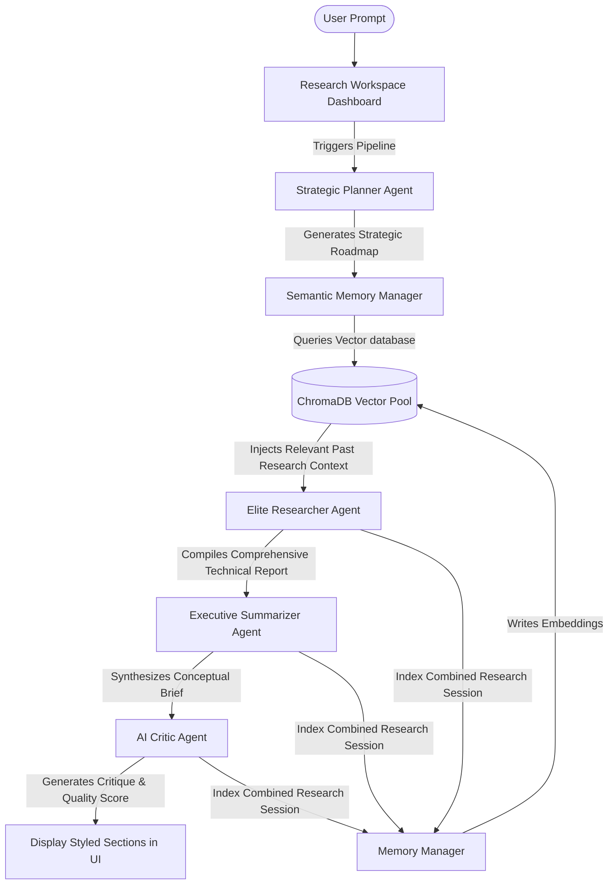

# WEEKLY PROGRESS REPORT

**Reporting No:** 2  
**Week No:** 2  
**From:** 22/05/2026 **To:** 29/05/2026  
**College ID:** 24AIML007  
**Student Name:** Man Dhanani  
**Project Title:** Autonomous Multi-Agent Research Assistant  

---

## 🌌 Project Overview
The objective of this project is to develop an Autonomous Multi-Agent Research Assistant capable of performing intelligent technical research using collaborative AI agents. The system automates multiple stages of the research lifecycle, including planning, information generation, summarization, critique analysis, and long-term semantic memory storage.

---

## 📐 System Workflow Architecture (Week-2)
In Week-2, the multi-agent pipeline has been updated to incorporate a strategic planning layer and dynamic semantic memory context injection. The revised execution pipeline operates as follows:

The execution flow consists of:
1.  **Strategic Planning**: The system initiates by planning the study routes and outlines.
2.  **Context-Aware Ingestion**: Before query compilation, vector databases are scanned for historical records to serve as context for the research agent.
3.  **Collaborative Assembly**: The researcher compiles raw technical literature, which is subsequently summarized and critiqued.
4.  **Persistent Storage**: The session data is vectorized and archived to semantic pools for future search context.

---

## 🛠 Work Done in Last Week (Week-2)

### 1. Strategic Planner Agent Integration
*   Integrated the Planner Agent into the live multi-agent execution pipeline to generate strategic roadmaps and set outlines at the start of each run.
*   Designed a dedicated UI dashboard component to display strategic objectives dynamically using custom typography and vector layouts.

### 2. Semantic Retrieval Memory (RAG) Integration
*   Connected the vector database retrieval pipeline to the Researcher module to fetch semantically matching historical records prior to drafting.
*   Designed interactive relevance indicators and similarity progress metrics inside the expanded memory components to monitor data retrieval.

### 3. Agentic Self-Correction & Refinement Loops (Self-Correlation)
*   Implemented self-correction mechanics where report drafts undergo automated critique audits.
*   Configured feedback channels that adapt sections of the output, correcting analytical gaps and format deficiencies before final saving.

### 4. AI Memory Bank Dashboard View
*   Designed and built a dedicated vector storage explorer page to inspect active collections in real time.
*   Structured custom collapsible memory cards featuring a premium green theme, inline folder icons, calendar-clock badges, and unique identification badges.

### 5. Database Optimization & Startup Concurrency Fixes
*   Created an asynchronous pre-warming background thread at application startup to pre-load embedding model weights, eliminating the saving delay on the first query.
*   Verified compilation and syntax checking on all changed front-end dashboard pages to ensure a stable, error-free runtime.

---

## 📊 Technologies Utilized

| Technology | Purpose |
| :--- | :--- |
| **Python 3.11** | Core development runtime & syntax validation |
| **Streamlit** | Multi-page SaaS dashboard & page routing |
| **Groq LLM API** | Low-latency agent reasoning |
| **ChromaDB** | Vector database for storing and querying memories |
| **Sentence Transformers** | Text embedding generation pipeline |
| **Lucide SVGs** | Custom micro-animations & layout icons |
| **Git & GitHub** | Version control & remote repository management |

---

## ⚠️ Reason for Incomplete Work
Advanced integrations—specifically connecting the Researcher Agent to live academic databases (like ADS), full-length document data chunking engines, and multi-turn correction loops—are currently undergoing modular testing and will be merged into the active pipeline during Week 3.

---

## 🎯 Plans for Next Week (Week-3)
1.  **Academic Search API Integration:** Connect the Researcher to professional repositories (like Semantic Scholar or arXiv APIs) to extract peer-reviewed sources.
2.  **Full-Length Document Parsing:** Implement a sliding window chunking algorithm using document text/table extractors to process long scientific articles.
3.  **LaTeX & BibTeX Export Engine:** Build exporting layouts in the Report Agent to compile files into LaTeX templates and BibTeX databases.
4.  **Multi-User Context Spaces:** Partition vector spaces into isolated workspaces to keep research contexts separate and highly relevant.

---

## 📚 References
1.  **Streamlit Layout Guidelines** (https://docs.streamlit.io)
2.  **Chroma Vector DB Integration** (https://docs.trychroma.com)
3.  **Groq Speculative Decoding API** (https://console.groq.com/docs)
4.  **Hugging Face Embeddings Library** (https://sbert.net)
5.  **Lucide Icon Library** (https://lucide.dev)

---

**Student ID:** 24AIML007  
**Student Name:** Man Dhanani  
**Student Signature:** \_\_\_\_\_\_\_\_\_\_\_\_\_\_\_\_\_\_  

**External Guide Signature:** \_\_\_\_\_\_\_\_\_\_\_\_\_\_\_\_\_\_  
**Internal Guide Signature:** \_\_\_\_\_\_\_\_\_\_\_\_\_\_\_\_\_\_  
